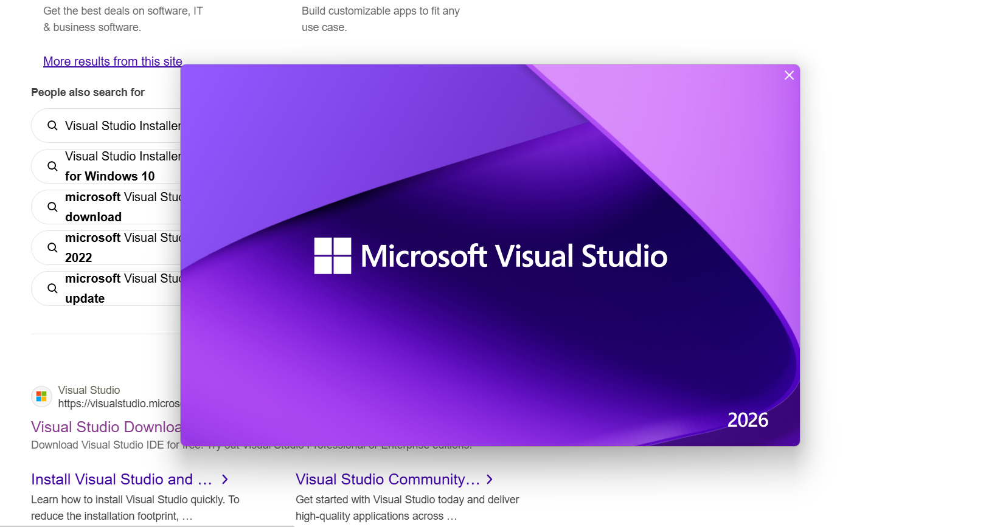
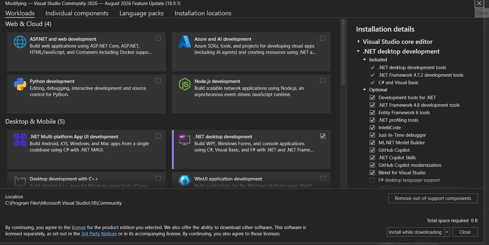

# Praktikum Pemrograman Visual

## Pertemuan 1 — Pengenalan Pemrograman Visual

### Pembahasan

Pada pertemuan pertama, kami membahas terlebih dahulu mengenai apa itu pemrograman visual dan untuk apa pemrograman visual digunakan.

Pemrograman visual merupakan cara membuat program dengan bantuan tampilan visual sehingga proses pembuatan program menjadi lebih mudah dipahami, terutama bagi orang yang masih baru belajar pemrograman. Dengan adanya komponen dan tampilan yang lebih visual, pengguna tidak harus langsung memahami coding yang terlalu kompleks.

Pemrograman visual juga memiliki keterbatasan. Penggunaannya lebih ditujukan untuk mempermudah pembuatan aplikasi tertentu dan tidak selalu cocok untuk membuat program dengan kebutuhan atau logika yang sangat kompleks.

### Instalasi Visual Studio

Setelah membahas pengertian dan penggunaan pemrograman visual, kami melakukan instalasi **Visual Studio** yang akan digunakan sebagai software utama untuk praktikum pada pertemuan berikutnya.

### Instalasi .NET

Selain Visual Studio, kami juga melakukan instalasi **.NET** sebagai platform yang akan digunakan dalam praktikum Pemrograman Visual.

### Kesimpulan

Pada pertemuan pertama, kami masih berada pada tahap pengenalan Pemrograman Visual. Pembahasan berfokus pada pengertian, tujuan, serta keterbatasan Pemrograman Visual. Kami juga melakukan instalasi Visual Studio dan .NET sebagai persiapan untuk praktikum pada pertemuan selanjutnya.
