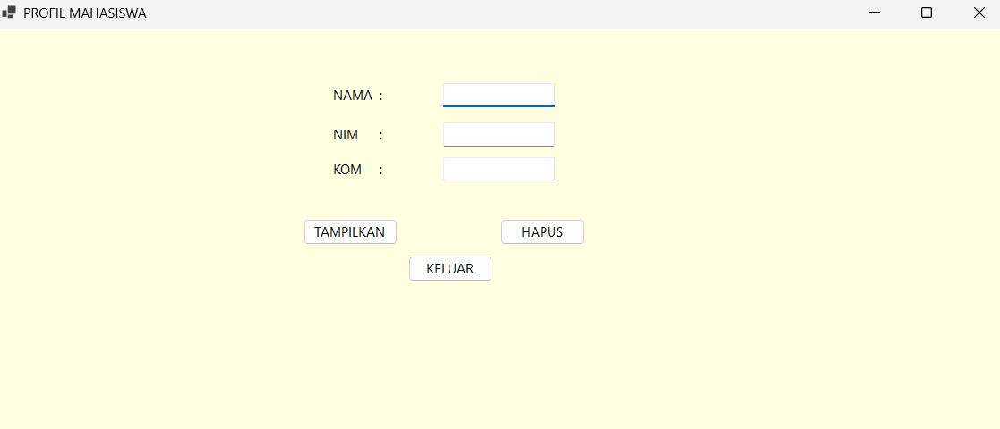

# Praktikum Pemrograman Visual

## Pertemuan 2 — Komponen Visual

### Pembahasan

Pada pertemuan kedua, kami mulai melakukan praktik menggunakan Visual Studio. Materi yang dipelajari adalah beberapa komponen dasar pada pemrograman visual, yaitu **Label, TextBox, dan Button**.

Selain membuat tampilan, kami juga belajar membuat **event** pada button sehingga setiap tombol dapat menjalankan perintah tertentu ketika ditekan.

### 1. Label

**Label** digunakan untuk menampilkan teks atau keterangan pada form. Pada praktik ini, Label digunakan sebagai penanda untuk beberapa data mahasiswa seperti:

* Nama
* NIM
* Kom

Label membantu pengguna mengetahui informasi yang harus diisi atau ditampilkan pada form.


### 2. TextBox

**TextBox** digunakan sebagai tempat untuk memasukkan data atau teks. Pada praktik ini, TextBox digunakan untuk mengisi data profil mahasiswa, yaitu nama, NIM, dan kom.

Setiap TextBox memiliki atribut **Name** yang digunakan sebagai identitas komponen ketika dipanggil di dalam kode program sama untuk setiap komponen bukan hanya untuk TextBox saja.


### 3. Button

**Button** digunakan sebagai tombol yang dapat menjalankan perintah tertentu. Pada praktik ini terdapat beberapa button, yaitu:

* **Tampilkan**, untuk menampilkan data yang sudah diisi.
* **Hapus**, untuk menghapus atau mengosongkan data pada form.
* **Keluar**, untuk keluar dari form.


### 4. Event Tampilkan

Pada button **Tampilkan**, kami membuat event ketika tombol tersebut diklik. Data yang terdapat pada TextBox kemudian dipanggil menggunakan atribut **Name** dari masing-masing komponen.

Data tersebut kemudian ditampilkan dalam bentuk popup.

Contoh pemanggilan data:

```vb
MessageBox.Show("Nama: " & txtNama.Text & vbCrLf &
                "NIM: " & txtNim.Text & vbCrLf &
                "Kom: " & txtKom.Text)
```

Dari praktik ini kami memahami bahwa atribut **Name** pada komponen dapat digunakan untuk memanggil komponen tersebut di dalam kode, mirip dengan konsep pemanggilan variabel yang pernah dipelajari pada pemrograman Java.


### 5. Event Hapus

Button **Hapus** digunakan untuk mengosongkan data yang terdapat pada form profil mahasiswa.

Ketika tombol Hapus diklik, isi TextBox seperti nama, NIM, dan kom akan dihapus sehingga form dapat digunakan kembali untuk mengisi data baru.

Contohnya:

```vb
txtNama.Clear()
txtNim.Clear()
txtKom.Clear()
```


### 6. Event Keluar

Button **Keluar** digunakan untuk keluar dari form. Ketika tombol tersebut diklik, form akan ditutup.

Contoh kode:

```vb
Me.Close()
```


### 7. Hasil Praktik

Hasil dari praktik pertemuan kedua adalah sebuah form profil mahasiswa yang terdiri dari:

* Label untuk memberikan keterangan.
* TextBox untuk memasukkan data nama, NIM, dan kom.
* Button Tampilkan untuk menampilkan data dalam popup.
* Button Hapus untuk mengosongkan data.
* Button Keluar untuk menutup form.



### Kesimpulan

Pada pertemuan kedua, kami mempelajari beberapa komponen dasar pada pemrograman visual, yaitu Label, TextBox, dan Button. Selain membuat tampilan form, kami juga belajar membuat event pada button sehingga komponen dapat menjalankan perintah ketika digunakan.

Dari praktik ini kami mulai memahami hubungan antara komponen visual dengan kode program, seperti memanggil data dari TextBox menggunakan atribut **Name**, menampilkan data menggunakan popup, menghapus isi form, dan menutup form.
