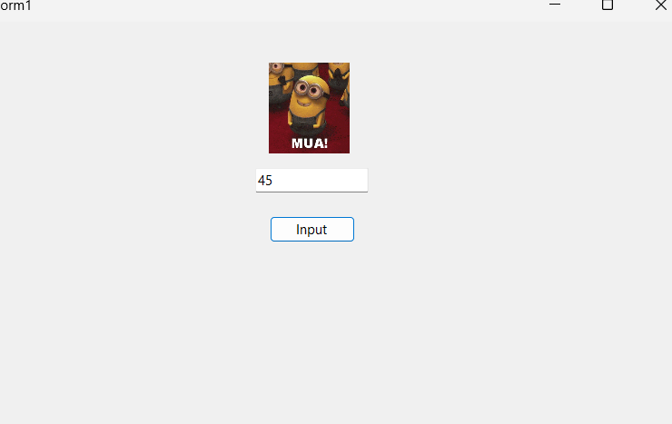

# Pertemuan 3 — Operator dan Struktur Kendali

## Pembahasan

Pada pertemuan 3 membahas tentang operator dan struktur kendali pada Visual Basic. Pada praktik kali ini digunakan operator aritmatika serta logika percabangan `If`, `ElseIf`, dan `Else`.

Selain itu, pada bagian GUI digunakan beberapa komponen seperti `TextBox`, `Button`, dan `PictureBox`.

---

## 1. Operator Aritmatika

Operator aritmatika digunakan untuk melakukan operasi perhitungan dalam program.

Beberapa operator aritmatika pada Visual Basic:

| Operator | Fungsi |
|---|---|
| `+` | Penjumlahan |
| `-` | Pengurangan |
| `*` | Perkalian |
| `/` | Pembagian |
| `Mod` | Sisa hasil pembagian |

Contoh penggunaan:

```vb
Dim hasil As Integer
hasil = 10 + 5
```

Hasil dari operasi tersebut adalah `15`.

---

## 2. Struktur Kendali If Else

Struktur `If...Else` digunakan untuk menjalankan perintah berdasarkan kondisi tertentu.

Bentuk dasar:

```vb
If kondisi Then
    ' perintah
Else
    ' perintah lainnya
End If
```

Selain `If` dan `Else`, terdapat `ElseIf` yang digunakan jika terdapat lebih dari satu kondisi.

Contoh:

```vb
If nilaiUjian <= 50 Then
    ' kondisi pertama
ElseIf nilaiUjian <= 75 Then
    ' kondisi kedua
Else
    ' kondisi lainnya
End If
```

Pada praktik ini, struktur tersebut digunakan untuk menentukan gambar yang akan ditampilkan berdasarkan nilai ujian yang dimasukkan.

---

## 3. Validasi Input

Sebelum nilai diproses, input dari `TextBox` diperiksa terlebih dahulu menggunakan `Integer.TryParse()`.

```vb
Dim nilaiUjian As Integer

If Not Integer.TryParse(txtNilai.Text, nilaiUjian) Then
    MessageBox.Show("Masukkan dalam bentuk angka")
    txtNilai.Focus()
    Return
End If
```

`Integer.TryParse()` digunakan untuk memastikan input dapat dibaca sebagai angka.

Jika pengguna memasukkan selain angka, program akan menampilkan pesan:

> Masukkan dalam bentuk angka

Setelah itu fokus kembali ke `TextBox`.

---

## 4. Pembatasan Nilai

Nilai ujian yang dimasukkan dibatasi dari `0` sampai `100`.

```vb
If nilaiUjian < 0 OrElse nilaiUjian > 100 Then
    MessageBox.Show("Masukkan nila 0 - 100")
    txtNilai.Focus()
    Return
End If
```

Jika nilai kurang dari `0` atau lebih dari `100`, program akan menampilkan pesan bahwa nilai harus berada pada rentang `0 - 100`.

Operator `OrElse` digunakan untuk mengecek apakah salah satu dari dua kondisi bernilai benar.

---

## 5. PictureBox

`PictureBox` merupakan komponen GUI yang digunakan untuk menampilkan gambar pada Windows Forms.

Pada praktik ini, `PictureBox` digunakan untuk menampilkan gambar berdasarkan nilai ujian.

Kode yang digunakan:

```vb
If nilaiUjian <= 50 Then
    picImage.Image = Image.FromFile("Assets\giphy.gif")

ElseIf nilaiUjian <= 75 Then
    picImage.Image = Image.FromFile("Assets\giphy1.webp")

Else
    picImage.Image = Image.FromFile("Assets\giphy2.webp")
End If
```

Pembagian kondisi nilai:

| Nilai | Gambar |
|---|---|
| `0 - 50` | `giphy.gif` |
| `51 - 75` | `giphy1.webp` |
| `76 - 100` | `giphy2.webp` |

Gambar diambil dari folder `Assets` menggunakan `Image.FromFile()`.

---

## 6. KeyPress pada TextBox

Pada `TextBox` diberikan validasi menggunakan event `KeyPress`.

Tujuannya agar pengguna hanya dapat memasukkan angka.

```vb
If Not Char.IsControl(e.KeyChar) AndAlso Not Char.IsDigit(e.KeyChar) Then
    e.Handled = True
End If
```

`Char.IsDigit()` digunakan untuk memeriksa apakah karakter yang dimasukkan merupakan angka.

Sedangkan `Char.IsControl()` digunakan agar tombol kontrol seperti Backspace tetap dapat digunakan.

`e.Handled = True` digunakan untuk mencegah karakter yang tidak sesuai dimasukkan ke dalam `TextBox`.

---

## 7. Button Input

Button `Input` digunakan untuk menjalankan proses setelah pengguna memasukkan nilai.

Event yang digunakan:

```vb
Private Sub btnInput_Click(sender As Object, e As EventArgs) Handles btnInput.Click
```

Saat tombol `Input` ditekan, program akan:

1. Mengambil nilai dari `TextBox`.
2. Memeriksa apakah input berupa angka.
3. Memeriksa apakah nilai berada pada rentang `0 - 100`.
4. Mengecek kondisi menggunakan `If`, `ElseIf`, dan `Else`.
5. Menampilkan gambar pada `PictureBox` sesuai dengan nilai.

---

## 8. Kode Program

Berikut kode program yang digunakan pada praktik:

```vb
Public Class Form1
    Private Sub Form1_Load(sender As Object, e As EventArgs) Handles MyBase.Load

    End Sub

    Private Sub txtNilai_TextChanged(sender As Object, e As EventArgs) Handles txtNilai.TextChanged

    End Sub

    Private Sub btnInput_Click(sender As Object, e As EventArgs) Handles btnInput.Click
        Dim nilaiUjian As Integer

        If Not Integer.TryParse(txtNilai.Text, nilaiUjian) Then
            MessageBox.Show("Masukkan dalam bentuk angka")
            txtNilai.Focus()
            Return
        End If

        If nilaiUjian < 0 OrElse nilaiUjian > 100 Then
            MessageBox.Show("Masukkan nila 0 - 100")
            txtNilai.Focus()
            Return
        End If

        If nilaiUjian <= 50 Then
            picImage.Image = Image.FromFile("Assets\giphy.gif")

        ElseIf nilaiUjian <= 75 Then
            picImage.Image = Image.FromFile("Assets\giphy1.webp")

        Else
            picImage.Image = Image.FromFile("Assets\giphy2.webp")
        End If
    End Sub

    Private Sub txtNilai_KeyPress(sender As Object, e As KeyPressEventArgs) Handles txtNilai.KeyPress
        If Not Char.IsControl(e.KeyChar) AndAlso Not Char.IsDigit(e.KeyChar) Then
            e.Handled = True
        End If
    End Sub
End Class
```

---

## 9. Alur Program

Alur program yang dibuat pada praktik ini adalah:

```text
Input Nilai
     ↓
Cek apakah input angka
     ↓
Jika bukan angka → tampilkan pesan
     ↓
Cek nilai 0 - 100
     ↓
Jika tidak sesuai → tampilkan pesan
     ↓
Cek nilai dengan If Else
     ↓
┌───────────────┬────────────────┬────────────────┐
│ Nilai 0 - 50  │ Nilai 51 - 75  │ Nilai 76 - 100 │
│ Gambar 1      │ Gambar 2       │ Gambar 3       │
└───────────────┴────────────────┴────────────────┘
                       ↓
                Tampilkan di
                 PictureBox
```

---

## 10. Hasil Praktik

Pada praktik ini berhasil dibuat sebuah GUI yang dapat menerima input nilai ujian. Program melakukan pengecekan terhadap input yang diberikan dan menampilkan gambar yang berbeda sesuai dengan nilai yang dimasukkan.



---

## Kesimpulan

Pada pertemuan ini dipelajari penggunaan operator aritmatika dan struktur kendali `If`, `ElseIf`, dan `Else` pada Visual Basic.

Selain itu, dipelajari juga cara melakukan validasi input menggunakan `Integer.TryParse()`, membatasi input pada `TextBox`, serta menggunakan `PictureBox` untuk menampilkan gambar berdasarkan kondisi nilai.

Dengan menggunakan struktur kendali, program dapat memberikan hasil yang berbeda sesuai dengan kondisi yang telah ditentukan.