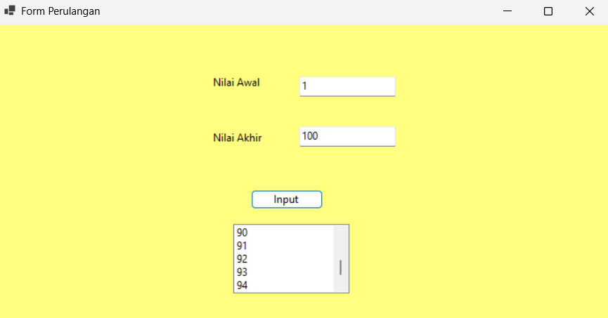

# Praktikum Pemrograman Visual - Pertemuan 4

## Struktur Pengulangan

### 1. Tujuan Praktikum

Mempelajari struktur pengulangan pada Visual Basic .NET dan menerapkannya pada program Windows Forms.

### 2. Pembahasan

Struktur pengulangan digunakan untuk menjalankan suatu perintah secara berulang berdasarkan kondisi atau batas tertentu.

Beberapa struktur pengulangan pada Visual Basic .NET yaitu:

- `For...Next`
- `While...End While`
- `Do While...Loop`
- `Do Until...Loop`
- `Nested Loop`

---

## 3. For...Next

`For...Next` digunakan untuk melakukan pengulangan berdasarkan nilai awal dan nilai akhir yang sudah ditentukan.

### Bentuk Umum

```vb
For i As Integer = nilaiAwal To nilaiAkhir
    ' perintah
Next
```

### Contoh

```vb
For i As Integer = 1 To 5
    Console.WriteLine(i)
Next
```

Hasil:

```text
1
2
3
4
5
```

### For dengan Step

`Step` digunakan untuk menentukan perubahan nilai pada setiap pengulangan.

Contoh pengulangan menurun:

```vb
For i As Integer = 10 To 1 Step -1
    Console.WriteLine(i)
Next
```

Hasil:

```text
10
9
8
7
6
5
4
3
2
1
```

---

## 4. While...End While

`While` digunakan untuk melakukan pengulangan selama kondisi bernilai `True`.

### Contoh

```vb
Dim i As Integer = 1

While i <= 5
    Console.WriteLine(i)
    i += 1
End While
```

Hasil:

```text
1
2
3
4
5
```

---

## 5. Do While...Loop

`Do While` digunakan untuk melakukan pengulangan selama kondisi bernilai `True`.

### Contoh

```vb
Dim i As Integer = 1

Do While i <= 5
    Console.WriteLine(i)
    i += 1
Loop
```

---

## 6. Do Until...Loop

`Do Until` digunakan untuk melakukan pengulangan sampai kondisi bernilai `True`.

### Contoh

```vb
Dim i As Integer = 1

Do Until i > 5
    Console.WriteLine(i)
    i += 1
Loop
```

Hasil:

```text
1
2
3
4
5
```

---

## 7. Nested Loop

Nested Loop adalah perulangan yang berada di dalam perulangan lainnya.

### Contoh

```vb
For i As Integer = 1 To 3
    For j As Integer = 1 To 2
        Console.WriteLine(i & " " & j)
    Next
Next
```

Perulangan bagian dalam akan dijalankan sampai selesai sebelum perulangan bagian luar berpindah ke nilai berikutnya.

---

# 8. Praktik yang Dilakukan

Pada praktikum ini dibuat sebuah program **Form Perulangan** untuk menampilkan angka berdasarkan nilai awal dan nilai akhir.

Komponen yang digunakan:

| Komponen | Nama |
|---|---|
| TextBox | `txtNilaiAwal` |
| TextBox | `txtNilaiAkhir` |
| Button | `btnInput` |
| ListBox | `lstHasil` |

Program dapat menampilkan angka secara naik maupun menurun.

Contoh:

- Nilai Awal = `1`
- Nilai Akhir = `100`

Maka program akan menampilkan angka dari `1` sampai `100`.

Jika:

- Nilai Awal = `100`
- Nilai Akhir = `1`

Maka program akan menampilkan angka dari `100` sampai `1`.

---

# 9. Validasi Input

Pada `txtNilaiAwal` dan `txtNilaiAkhir` digunakan event `KeyPress` agar pengguna hanya dapat memasukkan angka.

```vb
If Not Char.IsControl(e.KeyChar) AndAlso Not Char.IsDigit(e.KeyChar) Then
    e.Handled = True
End If
```

`Char.IsDigit()` digunakan untuk memeriksa apakah karakter yang dimasukkan berupa angka.

Sedangkan `Char.IsControl()` digunakan agar tombol seperti Backspace tetap dapat digunakan.

---

# 10. Integer.TryParse

Sebelum melakukan perulangan, input diperiksa terlebih dahulu menggunakan `Integer.TryParse()`.

```vb
Dim nilaiAwal As Integer

If Not Integer.TryParse(txtNilaiAwal.Text, nilaiAwal) Then
    MessageBox.Show("Masukkan dalam bentuk Angka")
    txtNilaiAwal.Focus()
    Return
End If
```

`Integer.TryParse()` digunakan untuk memastikan nilai dari TextBox dapat diubah menjadi tipe data `Integer`.

Jika input tidak valid, program menampilkan pesan dan kembali fokus ke TextBox.

Hal yang sama dilakukan pada `txtNilaiAkhir`.

---

# 11. Membersihkan ListBox

Sebelum menampilkan hasil baru, hasil sebelumnya dihapus menggunakan:

```vb
lstHasil.Items.Clear()
```

Hal ini dilakukan agar hasil perulangan sebelumnya tidak bercampur dengan hasil yang baru.

---

# 12. Perulangan Naik

Jika nilai awal lebih kecil atau sama dengan nilai akhir, program menggunakan `For...Next` biasa.

```vb
If nilaiAwal <= nilaiAkhir Then
    For i As Integer = nilaiAwal To nilaiAkhir
        lstHasil.Items.Add(i)
    Next
```

Contoh:

```text
Nilai Awal  = 1
Nilai Akhir = 10
```

Hasil:

```text
1
2
3
4
5
6
7
8
9
10
```

Nilai `i` akan bertambah satu pada setiap pengulangan.

---

# 13. Perulangan Menurun

Jika nilai awal lebih besar daripada nilai akhir, digunakan `Step -1`.

```vb
Else
    For i As Integer = nilaiAwal To nilaiAkhir Step -1
        lstHasil.Items.Add(i)
    Next
End If
```

Contoh:

```text
Nilai Awal  = 10
Nilai Akhir = 1
```

Hasil:

```text
10
9
8
7
6
5
4
3
2
1
```

`Step -1` menyebabkan nilai `i` berkurang satu pada setiap pengulangan.

---

# 14. Kode Program

```vb
Public Class FrmPerulangan

    Private Sub txtNilaiAwal_KeyPress(sender As Object, e As KeyPressEventArgs) Handles txtNilaiAwal.KeyPress
        If Not Char.IsControl(e.KeyChar) AndAlso Not Char.IsDigit(e.KeyChar) Then
            e.Handled = True
        End If
    End Sub

    Private Sub txtNilaiAkhir_KeyPress(sender As Object, e As KeyPressEventArgs) Handles txtNilaiAkhir.KeyPress
        If Not Char.IsControl(e.KeyChar) AndAlso Not Char.IsDigit(e.KeyChar) Then
            e.Handled = True
        End If
    End Sub

    Private Sub btnInput_Click(sender As Object, e As EventArgs) Handles btnInput.Click
        Dim nilaiAwal As Integer
        Dim nilaiAkhir As Integer

        If Not Integer.TryParse(txtNilaiAwal.Text, nilaiAwal) Then
            MessageBox.Show("Masukkan dalam bentuk Angka")
            txtNilaiAwal.Focus()
            Return
        End If

        If Not Integer.TryParse(txtNilaiAkhir.Text, nilaiAkhir) Then
            MessageBox.Show("Masukkan dalam bentuk Angka")
            txtNilaiAkhir.Focus()
            Return
        End If

        lstHasil.Items.Clear()

        If nilaiAwal <= nilaiAkhir Then
            For i As Integer = nilaiAwal To nilaiAkhir
                lstHasil.Items.Add(i)
            Next

        Else
            For i As Integer = nilaiAwal To nilaiAkhir Step -1
                lstHasil.Items.Add(i)
            Next
        End If
    End Sub

End Class
```

---

# 15. Alur Program

```text
Masukkan Nilai Awal
        ↓
Masukkan Nilai Akhir
        ↓
     Klik Input
        ↓
   Validasi Input
        ↓
Hapus Hasil Sebelumnya
        ↓
Apakah Nilai Awal <= Nilai Akhir?
        ↓
    ┌───┴───┐
   Ya      Tidak
    ↓         ↓
For biasa  For Step -1
    ↓         ↓
Perulangan  Perulangan
    ↓         ↓
    └────┬────┘
         ↓
Tampilkan Hasil
   di ListBox
```

---

# 16. Hasil Praktik

Program berhasil menampilkan angka berdasarkan nilai awal dan nilai akhir yang dimasukkan.

Pada percobaan:

```text
Nilai Awal  : 1
Nilai Akhir : 100
```

hasil yang ditampilkan pada ListBox dimulai dari angka `1` dan terus bertambah sampai `100`.

### Tampilan Program



---

# 17. Kesimpulan

Struktur pengulangan digunakan untuk menjalankan perintah secara berulang. Pada praktikum ini digunakan `For...Next` untuk menampilkan angka berdasarkan nilai awal dan nilai akhir.

Program menggunakan `For` biasa untuk menampilkan angka secara naik dan `Step -1` untuk menampilkan angka secara menurun. Selain itu, `Integer.TryParse()` digunakan untuk memvalidasi input agar berupa angka.